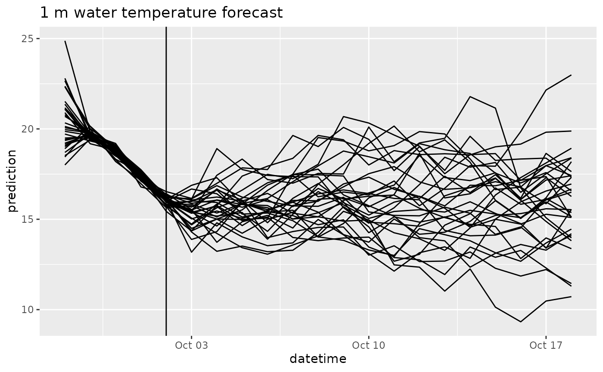
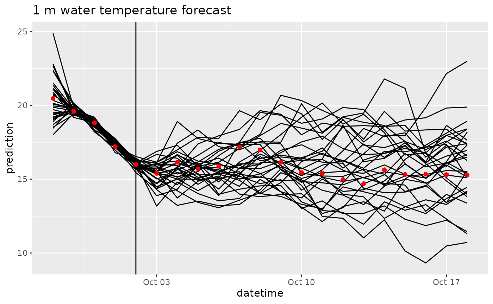
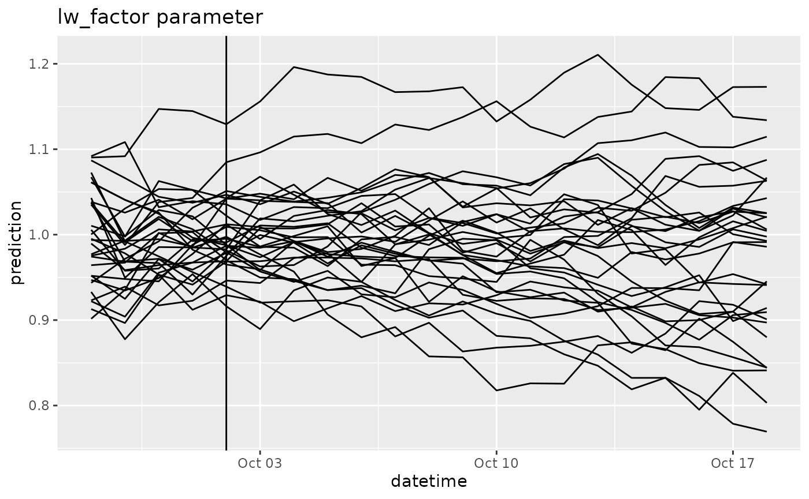

# FLAREr example

## Background

This document serves as a users guide and a tutorial for the FLARE
(Forecasting Lake and Reservoir Ecosystems) system ([Thomas et
al. 2020](https://agupubs.onlinelibrary.wiley.com/doi/abs/10.1029/2019WR026138)).
FLARE generates forecasts and forecast uncertainty of water temperature
and water quality for 1 to 35-dau ahead time horizon at multiple depths
of a lake or reservoir. It uses data assimilation to update the initial
starting point for a forecast and the model parameters based a real-time
statistical comparisons to observations. It has been developed, tested,
and evaluated for Falling Creek Reservoir in Vinton,VA ([Thomas et
al. 2020](https://agupubs.onlinelibrary.wiley.com/doi/abs/10.1029/2019WR026138))
and National Ecological Observatory Network lakes ([Thomas et
al. 2023](https://doi.org/10.1002/fee.2623)

FLARE is a set of R scripts that

- Generating the inputs and configuration files required by the General
  Lake Model (GLM)
- Applying data assimilation to GLM
- Processing and archiving forecast output
- Visualizing forecast output

FLARE uses the 1-D General Lake Model ([Hipsey et
al. 2019](https://www.geosci-model-dev.net/12/473/2019/)) as the
mechanistic process model that predicts hydrodynamics of the lake or
reservoir. For forecasts of water quality, it uses GLM with the Aquatic
Ecosystem Dynamics library. The binaries for GLM and GLM-AED are
included in the FLARE code that is available on GitHub. FLARE requires
GLM version 3.3 or higher.

More information about the GLM can be found here:

- [GLM 3.0.0 manuscript](https://www.geosci-model-dev.net/12/473/2019/)
- [GLM on GitHub](https://github.com/AquaticEcoDynamics/glm-aed)
- [GLM users guide](https://aquaticecodynamics.github.io/glm-workbook/)

FLARE development has been supported by grants from National Science
Foundation (CNS-1737424, DEB-1753639, EF-1702506, DBI-1933016,
DEB-1926050)

## Requirements

- [RStudio](https://rstudio.com/products/rstudio/download/)
- `FLAREr` R package
- `FLAREr` dependencies

## 1: Set up

First, install the `FLAREr` package from GitHub. There will be other
required packages that will also be downloaded.

``` r

remotes::install_github("flare-forecast/FLAREr")
```

Second, download the General Lake Model (GLM) code. You can get in using
multiple pathways

The easiest way is to install the `GLMAEDr` package from Github, which
downloads and manages the GLM binary for you:

``` r

remotes::install_github("flare-forecast/GLMAEDr")
#> Using github PAT from envvar GITHUB_PAT. Use `gitcreds::gitcreds_set()` and unset GITHUB_PAT in .Renviron (or elsewhere) if you want to use the more secure git credential store instead.
#> Skipping install of 'GLMAEDr' from a github remote, the SHA1 (460c89e0) has not changed since last install.
#>   Use `force = TRUE` to force installation
GLMAEDr::glm_install()
#> GLM is already installed at /home/runner/.local/share/R/GLMAEDr/glm.
#> ℹ Use `glm_install(force = TRUE)` to reinstall.
#> ℹ Run `GLMAEDr::glm_version()` to see the current version.
Sys.setenv('GLM_PATH'=GLMAEDr::glm_path())
```

Third, create a directory that will be your working directory for your
FLARE run. To find this directory on your computer you can use
`print(lake_directory)`

``` r

lake_directory <-  normalizePath(tempdir(),  winslash = "/")
dir.create(file.path(lake_directory, "configuration/default"), recursive = TRUE)
dir.create(file.path(lake_directory, "targets")) # For QAQC data
dir.create(file.path(lake_directory, "drivers")) # Weather and inflow forecasts
```

## 2: Configuration files

First, `FLAREr` requires two configuration yaml files. The code below
copies examples from the `FLAREr` package.

``` r

file.copy(system.file("extdata", "configuration", "default", "configure_flare.yml", package = "FLAREr"), file.path(lake_directory, "configuration", "default", "configure_flare.yml"))
#> [1] TRUE
file.copy(system.file("extdata", "configuration", "default", "configure_run.yml", package = "FLAREr"), file.path(lake_directory, "configuration", "default", "configure_run.yml"))
#> [1] TRUE
```

Second, `FLAREr` requires a set of configuration CSV files. The CSV
files are used to define the states that are simulated and the
parameters that are calibrated. The code below copies examples from the
`FLAREr` package

``` r

file.copy(system.file("extdata", "configuration", "default", "parameter_calibration_config.csv", package = "FLAREr"), file.path(lake_directory, "configuration", "default", "parameter_calibration_config.csv"))
#> [1] TRUE
file.copy(system.file("extdata", "configuration", "default", "states_config.csv", package = "FLAREr"), file.path(lake_directory, "configuration", "default", "states_config.csv"))
#> [1] TRUE
file.copy(system.file("extdata", "configuration", "default", "depth_model_sd.csv", package = "FLAREr"), file.path(lake_directory, "configuration", "default", "depth_model_sd.csv"))
#> [1] TRUE
file.copy(system.file("extdata", "configuration", "default", "observations_config.csv", package = "FLAREr"), file.path(lake_directory, "configuration", "default", "observations_config.csv"))
#> [1] TRUE
```

Third, FLAREr requires GLM specific configurations files. For
applications that require on water temperature, only the GLM namelist
file is needed. Applications that require other water quality variables
will require additional namelist files that are associated with the aed
model.

``` r

file.copy(system.file("extdata", "configuration", "default", "glm3.nml", package = "FLAREr"), file.path(lake_directory, "configuration", "default", "glm3.nml"))
#> [1] TRUE
```

## 3: Observation and driver files

Since the FLAREr package for general application, scripts to download
and process observation and drivers are not included in the package.
Therefore the application of FLARE to a lake will require a set of
additional scripts that are specific to the data formats for the lakes.
The example includes files for application to FCR.

``` r

file.copy(from = system.file("extdata/targets", package = "FLAREr"), to = lake_directory, recursive = TRUE)
#> [1] TRUE
file.copy(from = system.file("extdata/drivers", package = "FLAREr"), to = lake_directory, recursive = TRUE)
#> [1] TRUE
```

First, FLAREr requires the observation file to have a specific name
(observations_postQAQC_long.csv) and format.

``` r

head(read_csv(file.path(lake_directory,"targets/fcre/fcre-targets-insitu.csv"), show_col_types = FALSE))
#> # A tibble: 6 × 5
#>   datetime            site_id depth observation variable   
#>   <dttm>              <chr>   <dbl>       <dbl> <chr>      
#> 1 2022-09-28 00:00:00 fcre        0        20.5 temperature
#> 2 2022-09-29 00:00:00 fcre        0        19.6 temperature
#> 3 2022-09-30 00:00:00 fcre        0        18.8 temperature
#> 4 2022-10-01 00:00:00 fcre        0        17.2 temperature
#> 5 2022-10-02 00:00:00 fcre        0        16.0 temperature
#> 6 2022-10-03 00:00:00 fcre        0        15.4 temperature
```

## 2: Configure simulation (GLM)

The configuration functions are spread across the files. These files are
described in more detail below

- `glm3.nml`
- `configure_flare.yml`
- `configure_run.yml`
- `states_config.csv`
- `observations_config.csv`
- `parameter_calibration_config.csv`
- `depth_model_sd.csv`

### configure_run.yml

This file is the configuration file that define the specific timing of
the run.

- `restart_file`: This is the full path to the file that you want to use
  as initial conditions for the simulation. You will set this to `NA` if
  the simulation is not a continuation of a previous simulation.
- `sim_name`: a string with the name of your simulation. This will
  appear in your output file names
- `forecast_days`: This is your forecast horizon. The max is `16` days.
  Set to `0`if only doing data assimilation with observed drivers.
- `start_datetime`: The date time of day you want to start a forecast.
  Because GLM is a daily timestep model, the simulation will start at
  this time. It uses `YYYY-MM-DD mm:hh:ss` format and must only be a
  whole hour. It is in the UTC time. It can be any hour if only doing
  data assimilation with observed drivers (forecast_days = 0). If
  forecasting (forecast_days \> 0) it is required to match up with the
  availability of a NOAA forecast. NOAA forecasts are available at the
  following times UTC so you must select a local time that matches one
  of these times (i.e., 07:00:00 at FCR is the 12:00:00 UTC NOAA
  forecast).
  - 00:00:00 UTC
  - 06:00:00 UTC
  - 12:00:00 UTC
  - 18:00:00 UTC
- `forecast_start_datetime`: The date that you want forecasting to start
  in your simulation. Uses the YYYY-MM-DD mm:hh:ss format (e.g.,
  “2019-09-20 00:00:00”). The difference between `start_time` and
  `forecast_start_datetime` determines how many days of data
  assimilation occur using observed drivers before handing off to
  forecasted drivers and not assimilating data
- `configure_flare`: name of FLARE configuration file located in your
  `configuration/[config_set]` directory (`configure_flare.yml`)
- `configure_obs`: name of optional observation processing configuration
  file located in your `configuration/[config_set]` directory
  (`configure_obs.yml`)
- `use_s3`: use s3 cloud storage for saving forecast, scores, and
  restart files.

### glm3.nml

`glm3.nml` is the configuration file that is required by GLM. It can be
configured to run only GLM or GLM + AED. This version is already
configured to run only GLM for FCR and you do not need to modify it for
the example simulation.

### configure_flare.yml

`configure_flare.yml` has the bulk of the configurations for FLARE that
you will set once and reuse. The end of this document describes all of
the configurations in `configure_flare.yml`. Later in the tutorial, you
will modify key configurations in `configure_flare.yml`

### states_config.csv

Needs to be in `configuration/[config_set]`

### observations_config.csv

Needs to be in your `configuration/[config_set]`

### parameter_calibration_config.csv

Needs to be in your `configuration/[config_set]`

## 3: Run your GLM example simulation

Read configuration files

The following reads in the configuration files and overwrites the
directory locations based on the lake_directory and directories provided
above. In practice you will specific these directories in the configure
file and not overwrite them.

``` r

next_restart <- FLAREr::run_flare(lake_directory = lake_directory,configure_run_file = "configure_run.yml", config_set_name = "default")
#> run config not found - clean start
#> Running forecast that starts on: 2022-09-28 00:00:00
#> Retrieving Observational Data...
#> Generating Met Forecasts...
#> Creating inflow/outflow files...
#> Setting states and initial conditions...
#> Warning: Unknown or uninitialised column: `assimilate`.
#> Running time step 1/20 : 2022-09-28 00:00 - 2022-09-29 00:00 [2026-08-18 19:56:48.714805]
#> performing data assimilation
#> zone1temp: mean 11.188 sd 1.1821
#> zone2temp: mean 14.5435 sd 1.3112
#> lw_factor: mean 0.9813 sd 0.0533
#> Running time step 2/20 : 2022-09-29 00:00 - 2022-09-30 00:00 [2026-08-18 19:56:54.45889]
#> performing data assimilation
#> zone1temp: mean 11.7664 sd 1.4657
#> zone2temp: mean 14.5105 sd 1.5636
#> lw_factor: mean 0.9975 sd 0.0479
#> Running time step 3/20 : 2022-09-30 00:00 - 2022-10-01 00:00 [2026-08-18 19:57:00.600236]
#> performing data assimilation
#> zone1temp: mean 12.3533 sd 1.5439
#> zone2temp: mean 14.8564 sd 2.0016
#> lw_factor: mean 0.9934 sd 0.047
#> Running time step 4/20 : 2022-10-01 00:00 - 2022-10-02 00:00 [2026-08-18 19:57:06.887583]
#> performing data assimilation
#> zone1temp: mean 11.9662 sd 1.3712
#> zone2temp: mean 14.6174 sd 2.0034
#> lw_factor: mean 0.9992 sd 0.0453
#> Running time step 5/20 : 2022-10-02 00:00 - 2022-10-03 00:00 [2026-08-18 19:57:12.970921]
#> zone1temp: mean 11.9904 sd 1.6024
#> zone2temp: mean 14.353 sd 2.0466
#> lw_factor: mean 0.9977 sd 0.054
#> Running time step 6/20 : 2022-10-03 00:00 - 2022-10-04 00:00 [2026-08-18 19:57:19.04611]
#> zone1temp: mean 12.352 sd 1.6812
#> zone2temp: mean 14.1183 sd 2.107
#> lw_factor: mean 1.0023 sd 0.0579
#> Running time step 7/20 : 2022-10-04 00:00 - 2022-10-05 00:00 [2026-08-18 19:57:25.255808]
#> zone1temp: mean 12.528 sd 1.9128
#> zone2temp: mean 14.143 sd 2.4284
#> lw_factor: mean 0.9989 sd 0.0584
#> Running time step 8/20 : 2022-10-05 00:00 - 2022-10-06 00:00 [2026-08-18 19:57:31.440991]
#> zone1temp: mean 12.7071 sd 2.0838
#> zone2temp: mean 14.0597 sd 2.7414
#> lw_factor: mean 0.9961 sd 0.0604
#> Running time step 9/20 : 2022-10-06 00:00 - 2022-10-07 00:00 [2026-08-18 19:57:37.606032]
#> zone1temp: mean 12.6385 sd 2.7449
#> zone2temp: mean 14.1229 sd 2.8831
#> lw_factor: mean 0.9958 sd 0.0655
#> Running time step 10/20 : 2022-10-07 00:00 - 2022-10-08 00:00 [2026-08-18 19:57:43.807696]
#> zone1temp: mean 12.8744 sd 3.0863
#> zone2temp: mean 14.5036 sd 3.421
#> lw_factor: mean 0.9959 sd 0.0679
#> Running time step 11/20 : 2022-10-08 00:00 - 2022-10-09 00:00 [2026-08-18 19:57:50.062257]
#> zone1temp: mean 12.9975 sd 3.1569
#> zone2temp: mean 14.6116 sd 3.3147
#> lw_factor: mean 0.9906 sd 0.0688
#> Running time step 12/20 : 2022-10-09 00:00 - 2022-10-10 00:00 [2026-08-18 19:57:56.361273]
#> zone1temp: mean 13.0151 sd 3.592
#> zone2temp: mean 14.7904 sd 3.5892
#> lw_factor: mean 0.9831 sd 0.0729
#> Running time step 13/20 : 2022-10-10 00:00 - 2022-10-11 00:00 [2026-08-18 19:58:02.631475]
#> zone1temp: mean 13.1916 sd 3.745
#> zone2temp: mean 14.7768 sd 3.7286
#> lw_factor: mean 0.981 sd 0.0707
#> Running time step 14/20 : 2022-10-11 00:00 - 2022-10-12 00:00 [2026-08-18 19:58:08.95817]
#> zone1temp: mean 13.133 sd 3.9506
#> zone2temp: mean 14.5343 sd 3.9267
#> lw_factor: mean 0.9869 sd 0.079
#> Running time step 15/20 : 2022-10-12 00:00 - 2022-10-13 00:00 [2026-08-18 19:58:15.190258]
#> zone1temp: mean 13.3424 sd 4.1387
#> zone2temp: mean 14.7532 sd 3.8953
#> lw_factor: mean 0.9856 sd 0.085
#> Running time step 16/20 : 2022-10-13 00:00 - 2022-10-14 00:00 [2026-08-18 19:58:21.459053]
#> zone1temp: mean 13.1681 sd 4.0783
#> zone2temp: mean 14.6548 sd 4.2755
#> lw_factor: mean 0.9787 sd 0.0871
#> Running time step 17/20 : 2022-10-14 00:00 - 2022-10-15 00:00 [2026-08-18 19:58:27.754474]
#> zone1temp: mean 12.8269 sd 4.4543
#> zone2temp: mean 14.6539 sd 4.0511
#> lw_factor: mean 0.9766 sd 0.0899
#> Running time step 18/20 : 2022-10-15 00:00 - 2022-10-16 00:00 [2026-08-18 19:58:34.033834]
#> zone1temp: mean 12.689 sd 4.9591
#> zone2temp: mean 14.651 sd 4.1249
#> lw_factor: mean 0.9749 sd 0.0922
#> Running time step 19/20 : 2022-10-16 00:00 - 2022-10-17 00:00 [2026-08-18 19:58:40.350389]
#> zone1temp: mean 12.6355 sd 5.0001
#> zone2temp: mean 14.3843 sd 4.2505
#> lw_factor: mean 0.9789 sd 0.0932
#> Running time step 20/20 : 2022-10-17 00:00 - 2022-10-18 00:00 [2026-08-18 19:58:46.689139]
#> zone1temp: mean 12.3381 sd 5.4279
#> zone2temp: mean 14.603 sd 4.5023
#> lw_factor: mean 0.9757 sd 0.0988
#> Writing restart
#> GLM restart zip written to: /tmp/RtmpY5oAan/restart/fcre/test/fcre-2022-10-02-test.zip
#> writing forecast
#> successfully generated flare forecats for: fcre-2022-10-02-test
```

Visualizing output

``` r

df <- arrow::open_dataset(file.path(lake_directory,"forecasts/parquet")) |> collect()
```

``` r

head(df)
#> # A tibble: 6 × 14
#>   reference_datetime  datetime            pub_datetime        depth family  
#>   <dttm>              <dttm>              <dttm>              <dbl> <chr>   
#> 1 2022-10-02 00:00:00 2022-09-28 00:00:00 2026-08-18 19:58:53     0 ensemble
#> 2 2022-10-02 00:00:00 2022-09-28 00:00:00 2026-08-18 19:58:53     0 ensemble
#> 3 2022-10-02 00:00:00 2022-09-28 00:00:00 2026-08-18 19:58:53     0 ensemble
#> 4 2022-10-02 00:00:00 2022-09-28 00:00:00 2026-08-18 19:58:53     0 ensemble
#> 5 2022-10-02 00:00:00 2022-09-28 00:00:00 2026-08-18 19:58:53     0 ensemble
#> 6 2022-10-02 00:00:00 2022-09-28 00:00:00 2026-08-18 19:58:53     0 ensemble
#> # ℹ 9 more variables: parameter <int>, variable <chr>, prediction <dbl>,
#> #   forecast <dbl>, variable_type <chr>, log_weight <dbl>, site_id <chr>,
#> #   model_id <chr>, reference_date <chr>
```

``` r

df |> 
  filter(variable == "temperature",
         depth == 1) |> 
  ggplot(aes(x = datetime, y = prediction, group = parameter)) +
  geom_line() +
  geom_vline(aes(xintercept = as_datetime(reference_datetime))) +
  labs(title = "1 m water temperature forecast")
```



``` r

targets_df <- read_csv(file.path(lake_directory, "targets/fcre/fcre-targets-insitu.csv"), show_col_types = FALSE)
combined_df <- left_join(df, targets_df, by = join_by(datetime, depth, variable, site_id))
combined_df |> 
  filter(variable == "temperature",
         depth == 1) |> 
  ggplot(aes(x = datetime, y = prediction, group = parameter)) +
  geom_line() +
  geom_vline(aes(xintercept = as_datetime(reference_datetime))) +
  geom_point(aes(y = observation), color = "red") +
  labs(title = "1 m water temperature forecast")
```



``` r

df |> 
  filter(variable == "lw_factor") |> 
  ggplot(aes(x = datetime, y = prediction, group = parameter)) +
  geom_line() +
  geom_vline(aes(xintercept = as_datetime(reference_datetime))) +
  labs(title = "lw_factor parameter")
```

 \##
5. Comparing to observations

## 6: Modifying FLARE

### Turning off data assimilation

In configure_flare.yml you can change `da_method` to “none”

### Removing parameter estimation

Set `par_config_file = .na` in the `configure_flare.yml`

### Increasing observational uncertainty

The second modification you will do is to to increase the observational
uncertainty. In `observations_config.csv` set `obs_sd = 1`.

### Changing the ensemble size

The variable `ensemble_size` allows you to adjust the size of the
ensemble.
